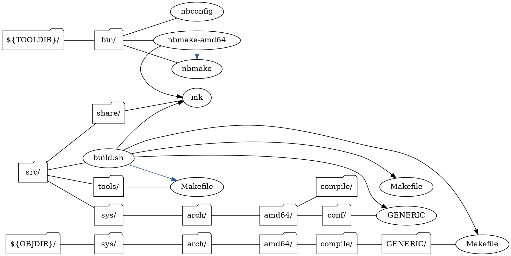

# DepTree

[](https://travis-ci.org/wataash/DepTree) [](https://codecov.io/gh/wataash/DepTree)

WIP

example: netbsd build.sh

in:

```
# ./build.sh -n -m amd64 -T ../tools u -U kernel=GENERIC
${TOOLDIR}/bin/nbconfig
${TOOLDIR}/bin/nbmake-amd64 ${TOOLDIR}/bin/nbmake x
${TOOLDIR}/bin/nbmake-amd64 ; wrapper for nbmake
${TOOLDIR}/bin/nbmake-amd64 src/share/mk ; MAKEFLAGS
src/build.sh ${OBJDIR}/sys/arch/amd64/compile/GENERIC/Makefile ; nmbake-amd64 depend all
src/build.sh src/share/mk ; nbmake -m src/share/mk
src/build.sh src/sys/arch/amd64/compile/Makefile ; nbmake-amd64 obj
src/build.sh src/sys/arch/amd64/conf/GENERIC ; nbconfig -b ${OBJDIR} -s src/netbsd/src/sys/
src/build.sh src/tools/Makefile x ; nbmake
```

out:




<!--
- CircleCI

watch on linux:

```fish
while true; clear; clear; npm run coverage; inotifywait -e create -r src/; end
```
-->
